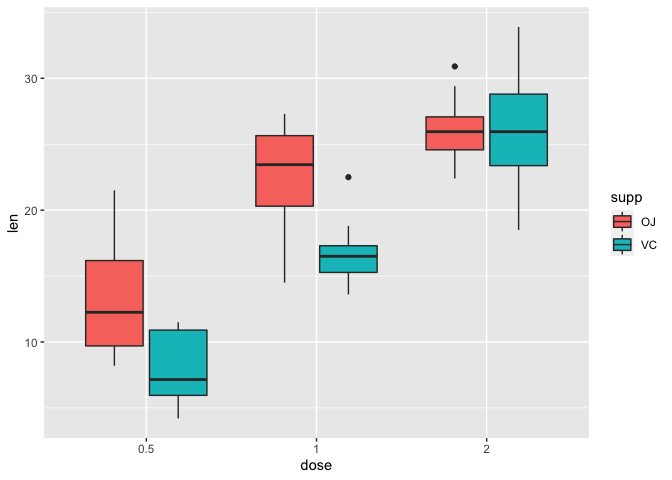

Comparando distribuciones
================
Isaac VM
2022-10-13

## Boxplots

Sirve para comparar distribuciones de variables discretas. Para estos
ejemplos se usara el dataset `ToothGrowth`.

``` r
# Cargar librerías
library(dplyr)
library(ggplot2)
library(rstatix)

# Cargar nuestros datos de interés
data <- ToothGrowth

# Inspeccionar nuestros datos
str(data)
```

    ## 'data.frame':    60 obs. of  3 variables:
    ##  $ len : num  4.2 11.5 7.3 5.8 6.4 10 11.2 11.2 5.2 7 ...
    ##  $ supp: Factor w/ 2 levels "OJ","VC": 2 2 2 2 2 2 2 2 2 2 ...
    ##  $ dose: num  0.5 0.5 0.5 0.5 0.5 0.5 0.5 0.5 0.5 0.5 ...

En nuestro dataset se puede observar que la variable `dose` no es de
tipo factor. Para que se pueda considerar una variable discreta hay que
convertirla a factor.

``` r
# Convertir la variable dose a factor
data$dose <- factor(data$dose)

# Comprobemos el cambio
str(data)
```

    ## 'data.frame':    60 obs. of  3 variables:
    ##  $ len : num  4.2 11.5 7.3 5.8 6.4 10 11.2 11.2 5.2 7 ...
    ##  $ supp: Factor w/ 2 levels "OJ","VC": 2 2 2 2 2 2 2 2 2 2 ...
    ##  $ dose: Factor w/ 3 levels "0.5","1","2": 1 1 1 1 1 1 1 1 1 1 ...

Antes de comenzar a graficar, hay que explicar que son los cuartiles y
el “resumen de los cinco números”.

### Cuartiles

Son valores que dividen una distribución de datos en cuatro partes
iguales. Estos valores ayudan a evaluar rápidamente la dispersión y la
tendencia central de un conjunto de datos.

-   **Q1** 25% de los datos es menor o igual a este valor

-   **Q2** 50% de los datos es menor o igual a este valor. Este valor es
    mejor conocido como la **mediana**

-   **Q3** 75% de los datos es menor o igual a este valor.

-   **IQR** Rango intercuartil, es la distancia entre el primer cuartil
    y el tercer cuartil (**Q1 - Q3**). Abarca centralmente el 50% de los
    datos.

La mediana y el rango intercuartil al no ser afectados por valores
extremos, constituyen una mejor medida de la tendencia central y la
dispersión de conjuntos de datos altamente asimétricos, en comparación
con la media y la desviación estándar.

### “Five-number summary”

Así como los cuartiles resumen y dividen en cuatro una distribución, los
percentiles la dividen en 100, el resumen de los cinco números se
encarga de hacerla más fácil de entender.

1.  **Mínimo de la muestra**
2.  **Q1** \<= 25%
3.  **Mediana** == 50%
4.  **Q3** \<= 75%
5.  **Máximo de la muestra**

``` r
# Cálculo en R básico
summary(data$len)
```

    ##    Min. 1st Qu.  Median    Mean 3rd Qu.    Max. 
    ##    4.20   13.07   19.25   18.81   25.27   33.90

``` r
summary(data)
```

    ##       len        supp     dose   
    ##  Min.   : 4.20   OJ:30   0.5:20  
    ##  1st Qu.:13.07   VC:30   1  :20  
    ##  Median :19.25           2  :20  
    ##  Mean   :18.81                   
    ##  3rd Qu.:25.27                   
    ##  Max.   :33.90

``` r
# Cálculo por grupos con dplyr
data_ss <- data %>% 
  group_by(supp, dose) %>% 
  summarise(min = min(len),
            q1 = quantile(len, probs = 0.25),
            q2 = quantile(len, probs = 0.50),
            q3 = quantile(len, probs = 0.75),
            max = max(len))
```

    ## `summarise()` has grouped output by 'supp'. You can override using the
    ## `.groups` argument.

``` r
data_ss
```

    ## # A tibble: 6 × 7
    ## # Groups:   supp [2]
    ##   supp  dose    min    q1    q2    q3   max
    ##   <fct> <fct> <dbl> <dbl> <dbl> <dbl> <dbl>
    ## 1 OJ    0.5     8.2  9.7  12.2   16.2  21.5
    ## 2 OJ    1      14.5 20.3  23.5   25.6  27.3
    ## 3 OJ    2      22.4 24.6  26.0   27.1  30.9
    ## 4 VC    0.5     4.2  5.95  7.15  10.9  11.5
    ## 5 VC    1      13.6 15.3  16.5   17.3  22.5
    ## 6 VC    2      18.5 23.4  26.0   28.8  33.9

``` r
# Cálculo con la función get_summary_stats() del paquete rstatix
data_ss2 <- data %>% 
  group_by(supp, dose) %>% 
  get_summary_stats(type = "five_number")

data_ss2
```

    ## # A tibble: 6 × 9
    ##   supp  dose  variable     n   min   max    q1 median    q3
    ##   <fct> <fct> <chr>    <dbl> <dbl> <dbl> <dbl>  <dbl> <dbl>
    ## 1 OJ    0.5   len         10   8.2  21.5  9.7   12.2   16.2
    ## 2 OJ    1     len         10  14.5  27.3 20.3   23.4   25.6
    ## 3 OJ    2     len         10  22.4  30.9 24.6   26.0   27.1
    ## 4 VC    0.5   len         10   4.2  11.5  5.95   7.15  10.9
    ## 5 VC    1     len         10  13.6  22.5 15.3   16.5   17.3
    ## 6 VC    2     len         10  18.5  33.9 23.4   26.0   28.8

Con esta información ya podemos definir un boxplot.

### Creando un boxplot

Un boxplot consiste en:


``` r
# Boxplot
ggplot(data, aes(dose, len, fill = supp)) +
  geom_boxplot()
```

<!-- -->
