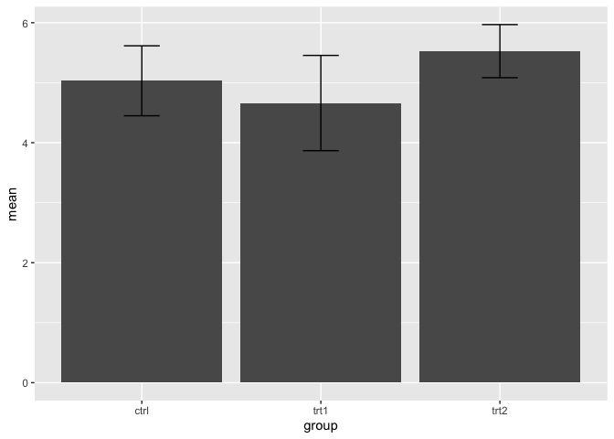

Introducción a visualización de datos en R con ggplot2
================
Isaac VM
2022-09-27

# Introducción

ggplot2 es un paquete de R para producir gráficos elegantes. A
diferencia de muchos otros paquetes, ggplot2 se rige bajo la gramática
de las gráficas, que nos permite crear gráficos combinando varios
elementos independientes. ggplot2 está diseñado para trabajar de manera
iterativa, es decir, inicias con una capa en la que muestras los datos
crudos, a la que después se le irán sumando otras capas como
anotaciones, estadísticos, etc.

# Estructura de una gráfica

Todas las gráficas están compuestas por datos, la información que nos
interesa visualizar. Estos datos están mapeados a atributos estéticos de
la gráfica. Hay cinco componentes a los que se pueden mapear nuestros
datos:

-   Capas (**layer**): Son una colección de elementos geométricos
    (**geom**) y transformaciones estadísticas (**stat**). Los elementos
    geométricos representan lo que realmente vemos en la gráfica
    (puntos, líneas, póligonos, etc.), mientras que las transformaciones
    estadísticas hacen resumenes estadísticos de nuestros datos como
    contar y agrupar datos al hacer un histograma.

-   Escalas (**scales**): Mapean el valor de los datos de manera
    estética y espacial en la gráfica. Esto incluye el uso de colores,
    formas o tamaño. Las escalas también dibujan los ejes y las
    leyendas, lo que ayuda a entender la gráfica.

-   Coordenadas (**coord**): Mapean el valor de los datos en el plano de
    la gráfica, también proporciona ejes y una gradilla para ayudar a
    leer la gráfica. Normalmente se utiliza el sistema de coordenadas
    cardinales pero también se pueden usar otros como las coordenadas
    polares o proyecciones de mapas.

-   Facetas (**facet**): Especifica como separar y visualizar los datos
    en subconjuntos.

-   Tema (**theme**): Controla detalles en específico de la gráfica,
    como el tamaño de fuente y el color del fondo

# Sintaxis de ggplot

Hay cuatro partes principales para crear una gráfica básica de ggplot:

-   La función `ggplot()`
-   El parámetro `data`
-   La geometría `geom_*`
-   El mapeo con la función `aes()`

## Función `ggplot()`

Es la función principal cada vez que queramos graficar algo la
llamaremos y casi todo se construye a partir de esta función.

## Parámetro `data`

Dentro de la función `ggplot()`, el primer parámatreo es `data`. Se
utiliza para especificar los datos que queremos graficar, usualmente
contenidos en un objeto `data.frame`.

## Geometrías `geom_*`

Objetos geométricos que representan los datos que estamos visualizando.
Es más fácil pensar como si fueran “tipos de gráficas”, ejemplos:

-   Gráficas de barras `geom_bar()`
-   Gráficas de líneas `geom_line()`
-   Histogramas `geom_hist()`

Es importante mencionar que las geometrías tienen atributos como:

-   Color
-   Posición (Eje x, y)
-   Forma
-   Tamaño

Estos atributos son los que mapean los datos que queremos visualizar con
el “tipo de gráfica” y esto se hace a través de la función `aes()`

## Función `aes()`

La función `aes()` permite mapear las variables de nuestros datos con
los atributos de las geometrías. Ejemplo, si queremos hacer una gráfica
de líneas, necesitamos indicar las coordenadas (x, y) para cada punto de
la línea por lo que en nuestra función
`aes(x = variable1, y = variable2)` debemos indicar las variables de
interés.

Como se mencionó anteriormente, los atributos (color, forma, etc.) se
pueden mapear hacía las variables, no solamente su posición.

## Ejemplos

Vamos a estudiar algunos ejemplos. Carguemos las librerías necesarias

``` r
library(ggplot2)
```

### Iris dataset

Trabajaremos algunos ejemplos con el dataset `iris`. Este dataset
consiste en 50 muestras de tres especies de Iris

-   *Iris setosa*
-   *Iris versicolor*
-   *Iris virginica*

Se midieron cuatro características:

-   Longitud pétalos
-   Longitud sépalos
-   Ancho pétalos
-   Ancho sépalos


### Exploración del dataset

El dataset se encuentra cargado por defecto en R por lo que no es
necesario cargar ningún archivo. Siempre es importante conocer nuestros
datos y como está estructurada la información por lo que adelante se
presentan unos ejemplos de funciones básicas para explorar un dataset.

``` r
# ver el dataset en una pestaña de Rstudio a parte
View(iris)

# head imprime las primeras filas de un dataframe
head(iris)
```

    ##   Sepal.Length Sepal.Width Petal.Length Petal.Width Species
    ## 1          5.1         3.5          1.4         0.2  setosa
    ## 2          4.9         3.0          1.4         0.2  setosa
    ## 3          4.7         3.2          1.3         0.2  setosa
    ## 4          4.6         3.1          1.5         0.2  setosa
    ## 5          5.0         3.6          1.4         0.2  setosa
    ## 6          5.4         3.9          1.7         0.4  setosa

``` r
# tail imprime las últimas filas de un dataframe
tail(iris)
```

    ##     Sepal.Length Sepal.Width Petal.Length Petal.Width   Species
    ## 145          6.7         3.3          5.7         2.5 virginica
    ## 146          6.7         3.0          5.2         2.3 virginica
    ## 147          6.3         2.5          5.0         1.9 virginica
    ## 148          6.5         3.0          5.2         2.0 virginica
    ## 149          6.2         3.4          5.4         2.3 virginica
    ## 150          5.9         3.0          5.1         1.8 virginica

``` r
# nombre de las columnas
colnames(iris)
```

    ## [1] "Sepal.Length" "Sepal.Width"  "Petal.Length" "Petal.Width"  "Species"

``` r
# estructura 
str(iris)
```

    ## 'data.frame':    150 obs. of  5 variables:
    ##  $ Sepal.Length: num  5.1 4.9 4.7 4.6 5 5.4 4.6 5 4.4 4.9 ...
    ##  $ Sepal.Width : num  3.5 3 3.2 3.1 3.6 3.9 3.4 3.4 2.9 3.1 ...
    ##  $ Petal.Length: num  1.4 1.4 1.3 1.5 1.4 1.7 1.4 1.5 1.4 1.5 ...
    ##  $ Petal.Width : num  0.2 0.2 0.2 0.2 0.2 0.4 0.3 0.2 0.2 0.1 ...
    ##  $ Species     : Factor w/ 3 levels "setosa","versicolor",..: 1 1 1 1 1 1 1 1 1 1 ...

El dataset `iris` se encuentra almacenado en un `data.frame`, el cual
contiene cinco columnas (variables) y 150 filas (observaciones). Las
primeras cuatro columnas son `Sepal.Length`, `Sepal.Width`,
`Petal.Length`, `Petal.Width` y contienen valores númericos (`num`)
mientras que la quinta columna, `Species`, contiene caracteres en forma
de factores (`Factor`) que indican a que especie pertenece cada
observación.

``` r
# Resumen estadístico sencillo
summary(iris)
```

    ##   Sepal.Length    Sepal.Width     Petal.Length    Petal.Width   
    ##  Min.   :4.300   Min.   :2.000   Min.   :1.000   Min.   :0.100  
    ##  1st Qu.:5.100   1st Qu.:2.800   1st Qu.:1.600   1st Qu.:0.300  
    ##  Median :5.800   Median :3.000   Median :4.350   Median :1.300  
    ##  Mean   :5.843   Mean   :3.057   Mean   :3.758   Mean   :1.199  
    ##  3rd Qu.:6.400   3rd Qu.:3.300   3rd Qu.:5.100   3rd Qu.:1.800  
    ##  Max.   :7.900   Max.   :4.400   Max.   :6.900   Max.   :2.500  
    ##        Species  
    ##  setosa    :50  
    ##  versicolor:50  
    ##  virginica :50  
    ##                 
    ##                 
    ## 

La función `summary()` nos brinda un resumen esdístico sencillo de cada
una de las variables, de aquí podemos corroborar que hay 50
observaciones por cada especie.

### Diagrama de dispersión (Scatter plot)

Sirve para identificar si hay correlación entre dos variables. ¿Habrá
alguna correlación entre la longitud y el ancho del sépalo?

``` r
ggplot(data = iris, mapping = aes(x = Sepal.Length, y = Sepal.Width)) +
  geom_point()
```

<!-- -->

De esta gráfica podemos observar como es que se mapearon los valores de
`Sepal.Length` en el eje x mientras que los valores de `Sepal.Width`
fueron mapeados al eje y. Cada punto representa una observación. De
manera visual podemos notar que se forman dos agrupaciones de puntos.
¿Será que las agrupaciones corresponden a diferentes especies de Iris?

Podemos mapear el color de los puntos a nuestra columna `Species` y
averiguar esta pregunta de manera sencilla.

``` r
# Mapear el color a la columna Species
ggplot(iris, aes(x = Sepal.Length, y = Sepal.Width, color = Species)) +
  geom_point()
```

<!-- -->

Ahora podemos observar que el primer grupo de datos corresponde a *Iris
versicolor* mientras que el segundo grupo de datos corresponde a las
otras dos especies. Si bien el primer grupo se separa claramente, el
segundo grupo no se logra separar completamente. ¿Se separará si
comparamos los pétalos?

``` r
# Mapear el color a la columna Species
ggplot(iris, aes(Petal.Length, Petal.Width, color = Species)) +
  geom_point()
```

<!-- --> De igual
manera se separan dos grupos de puntos, en el primero los datos de *Iris
versicolor* y en el segundo las otras dos especies, en esta ocasión ya
casi no presentan sobrelapes los puntos.

Otro aspecto interesante es que en el caso de los pétalos, parece que
hay una correlación linear entre su longitud y su ancho sin importar la
especie. Naturalmente, esto también se puede visualizar con `ggplot2`.

``` r
ggplot(iris, aes(Petal.Length, Petal.Width)) +
  geom_point(aes(color = Species)) +
  geom_smooth(method = "lm")
```

    ## `geom_smooth()` using formula 'y ~ x'

<!-- -->

Normalmente, también se agrega el valor de la correlación en la gráfica.

``` r
# cálculo de la correlación en R
cor(iris$Petal.Length, iris$Petal.Width)
```

    ## [1] 0.9628654

``` r
# lo agregamos en ggplot2
ggplot(iris, aes(Petal.Length, Petal.Width)) +
  geom_point(aes(color = Species)) +
  geom_smooth(method = "lm") +
  annotate("text", x = 5, y = 0.5, label = "r = 0.96")
```

    ## `geom_smooth()` using formula 'y ~ x'

<!-- -->

### Histograma

Representa la distribución de una variable. Hagamos un histograma con
nuestros datos:

``` r
# Histograma para Sepal.Length
ggplot(data = iris, mapping = aes(x = Petal.Length)) +
  geom_histogram()
```

    ## `stat_bin()` using `bins = 30`. Pick better value with `binwidth`.

<!-- -->

``` r
# Cambiar el ancho de los "bins"
ggplot(data = iris, mapping = aes(x = Petal.Length)) +
  geom_histogram(binwidth = 0.1)
```

<!-- -->

``` r
# Mapear el color por especies
ggplot(data = iris, mapping = aes(x = Petal.Length, fill = Species)) +
  geom_histogram()
```

    ## `stat_bin()` using `bins = 30`. Pick better value with `binwidth`.

<!-- -->

En la gráfica anterior podemos observar que la región en donde coinciden
dos especies, las columnas están apiladas por lo que la distribución por
especie no se aprecia de manera correcta. Dentro del llamado
`geom_histogram()` podemos agregar el parámetro `position = "identity"`
que lo que hace es dejar la posición de los datos sin “modificarla”.

``` r
# Sobrelapar los histogramas
ggplot(data = iris, mapping = aes(x = Petal.Length, fill = Species, color = Species)) +
  geom_histogram(position = "identity", alpha = 0.5)
```

    ## `stat_bin()` using `bins = 30`. Pick better value with `binwidth`.

<!-- -->

### Density

Representa la distribución de una variable numérica, se podría decir que
es una versíon teórica de un histograma, donde el ancho de los “bins”
tiende a cero mientras que el número de observaciones tiende al
infinito. Hay que notar que el eje `y` en el histograma representa el \#
de observaciones mientras que en el gráfico de densidad se representa,
como su nombre lo indica, la densidad.

``` r
ggplot(iris, aes(Petal.Length, fill = Species)) +
  geom_density(alpha = 0.5)
```

<!-- -->

#### Combinando geoms

Hasta el momento sólo hemos usado un `geom_*` por gráfica, pero se
pueden usar más de uno, cada capa que se agregue a la gráfica se ira
sobreponiendo a la anterior. De esta manera podemos crear un histograma
y un gráfico de densidad y comporar como se alinean estos.

``` r
ggplot(iris, aes(Petal.Length, fill = Species, color = Species)) +
  geom_histogram(aes(y = ..density..), position = "identity", alpha = 0.5) +
  geom_density(alpha = 0.6)
```

    ## `stat_bin()` using `bins = 30`. Pick better value with `binwidth`.

<!-- -->

### Bar plot

El gráfico de barras representa valores de diferentes variables
categóricas. En `ggplot2` hay dos formas de hacer gráficos de barras,
usando `geom_col()` y `geom_bar()`. Si se quiere representar el valor
exacto de los datos se sugiere usar `geom_col()` mientras que si se
quieren hacer transformaciones estadísticas (contar por defecto), se
utilizará `geom_bar()`.

Para estos gráficos usaremos el dataset `PlantGrowth` que consiste en
los resultados de un experimento que compara el peso seco de plantas
tratadas con dos diferentes tratamientos y un control.

``` r
head(PlantGrowth)
```

    ##   weight group
    ## 1   4.17  ctrl
    ## 2   5.58  ctrl
    ## 3   5.18  ctrl
    ## 4   6.11  ctrl
    ## 5   4.50  ctrl
    ## 6   4.61  ctrl

``` r
# Contar observaciones
ggplot(PlantGrowth, aes(group)) +
  geom_bar()
```

<!-- -->

``` r
# Resumen estadístico usando geom_bar()
ggplot(PlantGrowth, aes(group, weight)) +
  geom_bar(stat = "summary", fun = "mean")
```

<!-- -->

``` r
# Resumen estadístico usando stat_summary()
ggplot(PlantGrowth, aes(group, weight)) +
  stat_summary(geom = "bar", fun = "mean")
```

<!-- -->

Aunque se puede trabajar usando el dataset “crudo”, es conveniente crear
un resumen estadístico y crear nuestras gráficas a partir de ese
resumen.

Para crear este resumen usaremos funciones de la librería `dplyr`

``` r
library(dplyr)
```

    ## 
    ## Attaching package: 'dplyr'

    ## The following objects are masked from 'package:stats':
    ## 
    ##     filter, lag

    ## The following objects are masked from 'package:base':
    ## 
    ##     intersect, setdiff, setequal, union

``` r
# Crear resumen estadístico
plant_growth_ss <- PlantGrowth %>% 
  group_by(group) %>%
  summarise(mean = mean(weight),
            sd = sd(weight))

head(plant_growth_ss)
```

    ## # A tibble: 3 × 3
    ##   group  mean    sd
    ##   <fct> <dbl> <dbl>
    ## 1 ctrl   5.03 0.583
    ## 2 trt1   4.66 0.794
    ## 3 trt2   5.53 0.443

Con esta información ahora se puede crear una gráfica con sus
respectivas barras de error.

``` r
# Barras de error
ggplot(plant_growth_ss, aes(group, mean)) +
  geom_bar(stat = "identity") +
  geom_errorbar(aes(ymin = mean - sd, ymax = mean + sd), width = 0.2)
```

<!-- -->

Veamos otro ejemplo con el data set `ToothGrowth` y aprovechemos para ir
conociendo otras capas de `ggplot2` e ir “embelleciendo” nuestra
gráfica.

``` r
# Exploramos el dataset
str(ToothGrowth)
```

    ## 'data.frame':    60 obs. of  3 variables:
    ##  $ len : num  4.2 11.5 7.3 5.8 6.4 10 11.2 11.2 5.2 7 ...
    ##  $ supp: Factor w/ 2 levels "OJ","VC": 2 2 2 2 2 2 2 2 2 2 ...
    ##  $ dose: num  0.5 0.5 0.5 0.5 0.5 0.5 0.5 0.5 0.5 0.5 ...

``` r
# Creamos un resumen estadístico
tooth_growth_ss <- ToothGrowth %>% 
  mutate(dose = factor(dose)) %>%
  group_by(supp, dose) %>%
  summarise(mean = mean(len),
            sd = sd(len))
```

    ## `summarise()` has grouped output by 'supp'. You can override using the
    ## `.groups` argument.

``` r
tooth_growth_ss
```

    ## # A tibble: 6 × 4
    ## # Groups:   supp [2]
    ##   supp  dose   mean    sd
    ##   <fct> <fct> <dbl> <dbl>
    ## 1 OJ    0.5   13.2   4.46
    ## 2 OJ    1     22.7   3.91
    ## 3 OJ    2     26.1   2.66
    ## 4 VC    0.5    7.98  2.75
    ## 5 VC    1     16.8   2.52
    ## 6 VC    2     26.1   4.80

``` r
# Creamos nuestro gráfico
ggplot(tooth_growth_ss, aes(dose, mean, fill = supp)) +
  geom_bar(stat = "identity",
           position = "dodge",
           color = "black") +
  geom_errorbar(aes(ymin = mean - sd, ymax = mean + sd),
                width = 0.2,
                position = position_dodge(0.9)) +
  scale_fill_grey() +
  scale_y_continuous(expand = expansion(mult = c(0, 0.1))) + # Quitar espacio entre el eje x y las barras
  labs(title = "Vitamin C on effect on tooth growth in guinea pigs",
       x = "Dose (mg)",
       y = "Length",
       fill = "Supplement") +
  theme_classic()
```

<!-- -->
